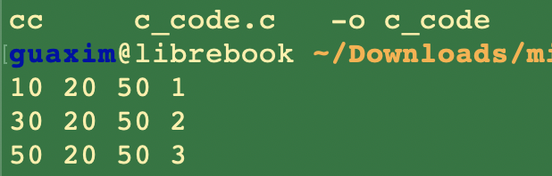
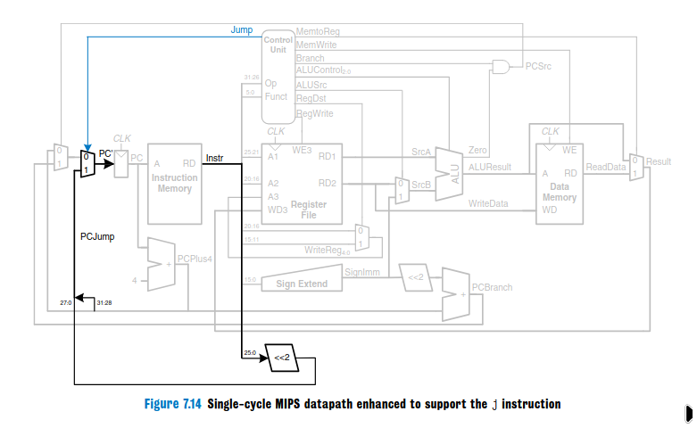

# mips microarchitecture
[Versão em português 🇧🇷](README_portuguese.md)


This project features an implementation of a single clock MIPS microarchitecture, as described in the book Digital Design and Computer Architecture. The instructions *add, addi, lw, sw, beq* and *j* were implemented, those were the only ones necessary to run our high level code, which can be found in **c_code.c**, and the assembly instructions it was translated to can be found in mips **instructions.asm**. Each of the modules described in the book can be found in it's own file, although they *might* be unupdated relative to appendedfile and master_master_file, which concentrate our current development versions.

## The instructions
### addi
The addi assembly instruction, whose syntax is ``addi $destination_reg, $base_reg, immediate`` sums *base_reg + the immediate. It's binary translation is as follows:

 ``01000 (opcode) (base_reg) (dest_reg) 16'b(immediate)`` 

The immediate value goes through sign extend, since the ALU only works with 32 bits values, properly padding it with ones and zeroes, depending on the values's sign (+ or -).

### lw
It loads values from memory into a register. In assembly, it's syntax is 

``lw $destination_reg, immediate_offset($reg_containing_the_offset)``

In binary: ``100011 offset_reg, destination_reg, 16'b(offset)``

Similarly to the addi, the offset passes through sign extend, get's summed with  *offset_reg and the result is the address of the memory slot of interest. The CU sets memtoreg (muxes the read data from mem rather than the aluresult) and alusrc and regwrite to 1, and the read data goes into the reg file's write data port.

### sw
Stores values into the memory, very similar to lw.

``sw $source_reg, offset(offsetreg)``

`` 101011 offsetreg, sourcereg, 16'b(memoffset)``

This time, however, memtowrite is 1, but regwrite and memtoreg are 0.

### add
add is a R-type instruction (opcode = 000000). this means that the aluop wont be used by the cu so to determine the alu's operation. Instead, the funct field of the instruction (instr[5:0]) will be used for such purpose. R instructions are divided in the fields *op, rs, rt, rd, shamt* and *funct*. Rd is the destination register, and shamt is only used for shift operations. Regdst is set to 1. Remember that regdst muxes instr[20:16] and instr[15:11] to the destination register, which is useful for R type instructions, since they use three registers.

``add dest, srca, srcb`` 

``000000 (r type opcode) srca, srcb, destreg, 00000, 100000 (funct field that makes the alu add)``


### beq
It's important to remember that the new **PC value = PC + 4 + SignImm x 4**. In the beq instruction, the imm goes through sign extend and then directly through <<2 and pcbranch, ending in the pc mux. The alu computes *regA - *regB. if zero, the zero wire coming from the alu transmits 1. Then PCsrc recieves branch && zero. In BEQ's case, branch is 1, so it actually pcsrc will only depend on regA == regB.

``beq regA, regB, imm``

``000100 (opcode), regA, regB, imm`` 

### j

The j instruction is quite complex, since it requires extra hardware that other instructions dont, because it writes directly into PC. It requires a new **jump** control signal and an extra pc multiplexer controlled by it. The CU sets regwrite and memwrite to 0 and jump to 1, the rest is *dont care*. Then, instr[25:0] goes through <<2 and fills the field [27:0] of the 32 bit wire that goes to the new pc mux. the [31:28] field comes from the current pc plus 4 value.

for example, a ``j 8``, which we used to jump to the instruction address 32,  would look be translated into:

``000010(opcode) 00000000000000000000001000 ``


## High level code

```c
#include <stdio.h>
int main(){
    int current_value = 10;
    int add_per_loop = 20;
    int target = 50;
    int loop_counter = 1;
    do {
	
	printf("%d %d %d %d\n",current_value, add_per_loop, target, loop_counter);
        current_value += add_per_loop;
        loop_counter += 1;

    } while(current_value != target);
    
    printf("%d %d %d %d\n",current_value, add_per_loop, target, loop_counter);
}
```

## microarchitecture overview

## Jump

