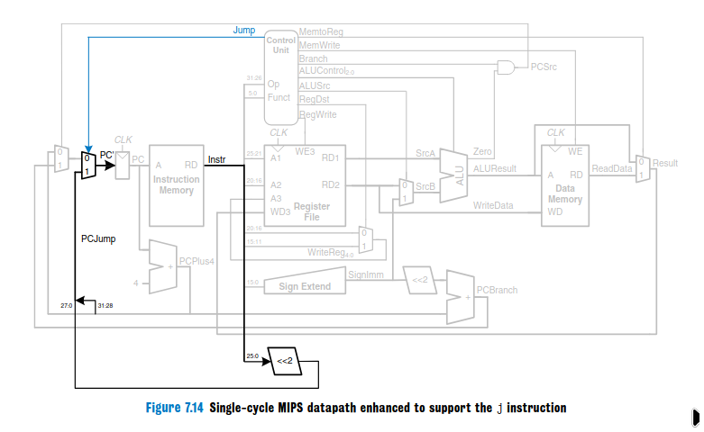

# **microarquitetura mips**

Esse projeto apresenta uma implementação de uma microarquitetura MIPS single clock, conforme descrito no livro Digital Design and Computer Architecture. As instruções *add, addi, lw, sw, beq* e *j* foram implementadas, e são únicas necessárias para executar nosso código de alto nível, que pode ser encontrado em **c\_code.c**, e as instruções assembly para as quais ele foi traduzido podem ser encontradas em **mips instructions.asm**. Cada um dos módulos descritos no livro pode ser encontrado em seu próprio arquivo, embora els *possam* estar desatualizados em relação ao appendedfile e ao master\_master\_file, que concentram nossas versões de desenvolvimento atuais.

## **As instruções**

### **addi**

A instrução de assembly addi, cuja sintaxe é `addi $destination_reg, $base_reg, immediate`, soma *base\_reg \+ o imediato*. Em binário:

`01000 (opcode) (base_reg) (dest_reg) 16'b(immediate)`

O valor imediato passa pelo Sign_Extend, já que a ALU só trabalha com valores de 32 bits, concatenando a 0s ou 1s o valor dele, dependendo do sinal.

### **lw**

Carrega valores da memória para um reg. Em assembly, w sintaxe é

`lw $destination_reg, immediate_offset($reg_containing_the_offset)`

Em binário: `100011 offset_reg, destination_reg, 16'b(offset)`

Assim como o addi, o offset passa pelo Sign_Extend, é somado com *offset\_reg* e o resultado é o endereço do slot de memória de interesse. A CU define memtoreg (seleciona no mux o read_data da memória em vez do aluresult) e alusrc e regwrite para 1, e os dados vão para a porta de escrita do regfile.

### **sw**

Armazena valores na memória, muito semelhante ao lw.

`sw $source_reg, offset(offsetreg)`

`101011 offsetreg, sourcereg, 16'b(memoffset)`

Dessa vez, contudo, memtowrite é 1, mas regwrite e memtoreg são 0\.

### **add**

Add é uma instrução do tipo R (opcode \= 000000). Isso significa que o aluop não será usado pelo CU para determinar a operação da ALU. Em vez disso, o campo funct da instrução (instr\[5:0\]) é que será. As instruções R são divididas nos campos *op, rs, rt, rd, shamt* e *funct*. Rd é o registrador de destino, e shamt é usado só para operações de shift. Regdst é definido como 1\. O Regdst muxa instr\[20:16\] e instr\[15:11\] para o registrador de destino, o que é útil para instruções do tipo R, pq elas usam tres registradores.

`add dest, srca, srcb`

`000000 (opcode tipo R) srca, srcb, destreg, 00000, 100000 (campo funct que faz a ALU somar)`

### **beq**

É importante lembrar que o novo **valor do PC \= PC \+ 4 \+ SignImm x 4**. Na instrução beq, o imm passa pelo Sign_Extend e depois diretamente por \<\<2 e pcbranch, terminando no mux do PC. A ALU calcula *regA \- regB*. Se for zero, o fio *zero*  da ALU transmite 1\. Então, PCsrc recebe branch && zero. No caso do BEQ, branch é 1, então, na verdade, pcsrc só vai depender de regA \== regB.

`beq regA, regB, imm`

`000100 (opcode), regA, regB, imm`

### **j**

A instrução j é bastante complexa, pois requer hardware extra que outras instruções não possuem, porque escreve diretamente no PC. Ela precisa de um novo sinal de controle **jump** e um multiplexador de PC extra controlado por ele. A CU define regwrite e memwrite como 0 e jump como 1, o resto é *não importa*. Então, instr\[25:0\] passa por \<\<2 e preenche o campo \[27:0\] do fio de 32 bits que vai para o novo mux do PC. O campo \[31:28\] vem do valor do PC plus 4 4\.

Por exemplo, um `j 8`, que usamos para saltar para o endereço da instrução 32, seria traduzido para:

`000010(opcode) 00000000000000000000001000`

## High level code

```c
#include <stdio.h>
int main(){
    int current_value = 10;
    int add_per_loop = 20;
    int target = 50;
    int loop_counter = 1;
    do {
	
	printf("%d %d %d %d\n",current_value, add_per_loop, target, loop_counter);
        current_value += add_per_loop;
        loop_counter += 1;

    } while(current_value != target);
    
    printf("%d %d %d %d\n",current_value, add_per_loop, target, loop_counter);
}
```


## microarchitecture overview

## Jump

